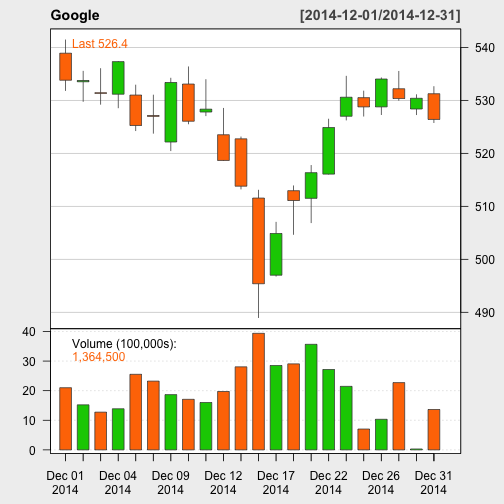

## About the app

- This app plots the stock market prices and market index over time
- It obtains the stock data from yahoo finance
- The plots display 3 Candlestick Charts (2 on stock information and 1 on market index) over a defined time period

---

## Quantmod package and processing involved

- The app requires both the shiny package and quantmod package. 
- It relies on two key functions from quantmod package - getSymbols and chartSeries
- The getSymbols function retrieve the information of the specified stock symbol (default source is Yahoo finance)

```r
library(quantmod)
```

```
## Warning: package 'quantmod' was built under R version 3.1.2
```

```
## Loading required package: xts
```

```
## Warning: package 'xts' was built under R version 3.1.2
```

```
## Loading required package: zoo
## 
## Attaching package: 'zoo'
## 
## The following objects are masked from 'package:base':
## 
##     as.Date, as.Date.numeric
## 
## Loading required package: TTR
```

```
## Warning: package 'TTR' was built under R version 3.1.2
```

```
## Version 0.4-0 included new data defaults. See ?getSymbols.
```

```r
plotData<-getSymbols("GOOG", from="2014/12/01", to="2015/01/01", auto.assign=FALSE)
```

```
##     As of 0.4-0, 'getSymbols' uses env=parent.frame() and
##  auto.assign=TRUE by default.
## 
##  This  behavior  will be  phased out in 0.5-0  when the call  will
##  default to use auto.assign=FALSE. getOption("getSymbols.env") and 
##  getOptions("getSymbols.auto.assign") are now checked for alternate defaults
## 
##  This message is shown once per session and may be disabled by setting 
##  options("getSymbols.warning4.0"=FALSE). See ?getSymbol for more details
```
- **chartSeries** plot the graph with the data retrieved from getSymbols

```r
chartSeries(plotData, type = 'candlesticks', name="Google")
```

---

## Observe the stock trend over time

 

---

## Links

- Try the app at: http://junkal.shinyapps.io/ShinyApp 
- Source code is at: https://github.com/junkal/Developing_Data_Products
